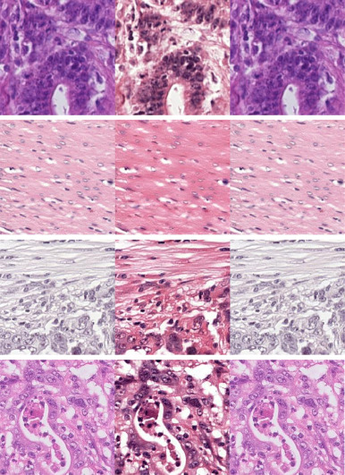

# pathology-cyclegan-stain-transformation

We provide our code that was used in the paper ['Residual cyclegan for robust domain transformation of histopathological tissue slides'](https://pubmed.ncbi.nlm.nih.gov/33647784/). The paper builds further on the original [CycleGAN](https://github.com/junyanz/CycleGAN) approach. Our method is specifically created for transferring between stain domains in digital histopathology. Some examples are shown below:

